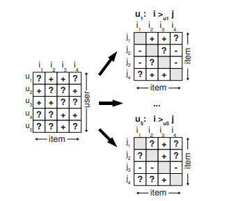

<!--more-->

## Introduction

Before I have shown [the fundamental]() lying on a recommendation method called implicit-feedback.
In statistics the Bayes theorem has been used and it is a powerful tool for machine learnings. I will show a method applying the Bayes theorem to the implicit feedback technique.

Compared to ones I have shown in my previous post, a method shown here focuses on personalized rankings, not scores like the number of clicks. However, the goal is the same in those methods and that is to show stuff people are interested in. Grasping ideas of the new method shown here would help you understand recommendation systems.

A paper shown here is [BPR: Bayesian personalized ranking from implicit feedback](#references). Let us see what it says.

## Main Idea

A main goal is to predict personalized rankings using feedbacks with some missing contents. In other methods, those missing values are often replaced with a certain value like 0.
But this method gives it a try to keep those values as they are. 

For our more precise exploration, let us define some formulae. Here, we want to think of showing an 'good' item for an user. Some feedback like records about who have bought an item has already been observed. Let $I$ and $U$ be the sets of items and users, respectively. Feedback can be written as a matrix and it has a positive value as its component when an user $u$ has taken an action on an item $i$. That is regarded as positive. The other components do not have any values (literally missing values). We write the set of pairs of an user and an item on which the user have feedback as $S$.

Although some methods regard those missing values as negative, the Bayes method interprets the missing values as follows:

If an user $u$ has feedback about an item $u$ and doesn't have any feedback about an item $j$, then the ranking of $i$ is higher than one of $j$.

As seen in the above, the Bayes method provides us another idea on missing values. To give personalized rankings, we define the following symbol.

$$
\begin{equation}
i >_{u} j,
\end{equation}
$$

where $u$ denotes an user and $i$ and $j$ denote items. The above symbol means that an user $i$ set a higher ranking to an item $i$ compared to an item $j$.

Furthermore, the following sets are defined.

$$
\begin{equation}
\begin{split}
I_u^+ &= \\{i \in I \mid (u, i) \in S\\} \\\
U_i^+ &= \\{u \in U \mid (u, i) \in S\\}.
\end{split}
\end{equation}
$$

The aboves mean a set of items on which an user $u$ have sent feedback and a set of users by which an item $i$ have feedback. I have said the assumption lying on this Bayes-based method and that denotes relations of items between an item which an user has not seen and one which the user has seen. To describe the relation, we define the following symbol $D_S$.

$$
\begin{equation}
D_S = \\{ (u,i,j) \mid i \in I_u^+ \land j \in I \backslash I_u^+ \\}
\end{equation}
$$

To summarize what we have seen as far, let us see the above figure taken from the original paper (Figure 2). A matrix on the left side denotes feedback and its column and row denote items and users, respectively. The symbol $+$ means there is feedback sent by an user to an item and $?$ represents a blank (no feedback). According to the assumption, for an user, they prefer an item with the symbol $+$ compared to one with the symbol $?$. That idea is shown on matrices on the right side of the figure. If a component at $(i, j)$ on the matrix is $+$, then a user would like the item $i$ compared to the item $j$. The symbol $-$ follows in the same manner. The symbol $?$ denotes there is no observed relation since both of the items are never seen or they have already been seen. 

As shown in [the previous post](), ideas based on matrix factorization are often used. In this paper, that factorization is going to be done.
That matrix being factorized is regarded as a parameter. In a sense of a probability, that idea is written as $p(i >_{u} j | \Theta) $, where $\Theta$ is a parameter and often a matrix in the matrix factorization.  We would like to predict $i >\_{u} j$ for all the pairs of $(i, j)$ belonging to $S$ (other pairs not belonging to $S$ cannot be predicted because there are no clues). Using the maximum likelihood estimation let us predict the parameter $\Theta$. Since the parameter $\Theta$ only depends on $S$, we get 

$$
\begin{equation}
p( >\_u |\Theta) = \prod_{u, i,j} p(i >_{u} j | \Theta) =  \prod\_{(u, i, j) \in D\_S}  \prod\_{(u, j, i) \in D\_S} p(i >\_{u} j | \Theta),
\end{equation}
$$

where $>\|u$ denotes all the preferences between items of an user $u$ and $C$ is a constant (tuples not belonging $D\_S$ are independent of $\Theta$). In the above we have used an assumption that each pair of preference between two items are independent. Furthermore, it is natural that $D\_S$ is asymmetric with respect to $i$ and $j$, that is,  

$$
\begin{equation}
p(i >\_{u} j | \Theta) =  1 - p(j >\_{u} i | \Theta). 
\end{equation}
$$

The above means we can consider only tuples contained in $D\_S$. Thus, using the Bayes theorem,

$$
\begin{equation}
p(\Theta | >\_u) \propto \prod\_{(u, i, j) \in D\_S} p(i >\_{u} j | \Theta) p(\Theta).
\end{equation}
$$

We can predict an optimal $\Theta$ if $p(i >\_{u} j | \Theta)$ and $p(\Theta)$ are given. First, the conditional probability is modeled using the logistic function.
It is written as

$$
\begin{equation}
p(i >\_{u} j | \Theta) = \sigma(\hat{x}\_{uij}(\Theta)) = \frac{1}{1 + \exp(-\hat{x}\_{uij}(\Theta))},
\end{equation}
$$

where $\sigma$ is he logistic function and $\hat{x}\_{uij}$ is a function mapping a parameter to $\mathbb{R}$. This $\hat{x}\_{uij}$ is given later.

The remaining is $p(\Theta)$ and that is thought as a Gaussian with the zero mean and a covariance matrix $\Sigma\_\Theta$. To reduce complexity, we set $\lambda\_\Theta I$ to $\Sigma\_\Theta$. 

Now we get all the components required to predict $\Theta$. The goal is to maximize the following quantity.

$$
\begin{equation}
\begin{split}
& \ln p(\Theta | >\_u) \\\
\propto & \ln \prod\_{(u, i, j) \in D\_S} p(i >\_{u} j | \Theta) p(\Theta) \\\
= & \sum\_{(u, i, j) \in D\_S} \ln p(i >\_{u} j | \Theta) + \ln p(\Theta) \\\
\propto & \sum\_{(u, i, j) \in D\_S} \ln \sigma(\hat{x}\_{uij}(\Theta)) - \lambda\_\Theta \\|\Theta\\|.
\end{split}
\end{equation}
$$

In the original paper, there two examples to define $\hat{x}\_{uij}$. One uses k-nearest neighbor. Since this post is a succession of talks about matrix factorization, another example using the matrix factorization is shown.

To give personalized rankings, we consider scores for each item of an user. Here $\hat{x}\_{ui}$ denotes the score of an item $i$ assigned to an user $u$. Using those scores, we define $\hat{x}\_{uij}$ as

$$
\begin{equation}
\hat{x}\_{uij} = \hat{x}\_{ui} - \hat{x}\_{uj}.
\end{equation}
$$

When we look back to the definition of $i >\_u j$, the symbol denotes how much an user $u$ prefers an item $i$ compared to an user $j$. Thus it is natural that $\hat{x}\_{uij}$ is represented as a difference between two scores, $\hat{x}\_{ui}$ and $\hat{x}\_{uj}$.

All the scores are considered as components of a matrix $\hat{X}$. It means $\hat{x}\_{ui}$ is the $(u, i)$-th component of the matrix $\hat{X}$. Then using the matrix decomposition, $\hat{X}$ is rewritten as

$$
\begin{equation}
\hat{X} = WH^\top,
\end{equation}
$$

where $W \in \mathbb{R}^{|U| \times k}$, $H \in \mathbb{R}^{k \times |I|}$ and a parameter $k$ is a dimension you choose. Those two matrices $W$ and $H$ are the parameter $\Theta$.
Note that the score $\hat{x}\_{ui}$ is written as

$$
\begin{equation}
\hat{x}\_{ui} = \sum\_{f} w\_{uf} h\_{if}.
\end{equation}
$$

Using the above, we can get $\hat{x}_{uij}$.

As shown before, we have already seen the objective function to predict the parameter $\Theta$. Here $F$ denotes that function. To get an optimizer, it is required to differentiate the function $F$. That is written as

$$
\begin{equation}
\frac{\partial F}{\partial \Theta} = \sum\_{(u, i, j) \in D\_S)} \frac{\exp(-\hat{x}\_{uij})}{1 + \exp(-\hat{x}\_{uij})} \frac{\partial}{\partial \Theta} \hat{x}\_{uij} + \lambda\_\Theta \Theta.
\end{equation}
$$

Although the summation appears, this summation can be removed by using stochastic gradient method. First we draw a tuple $(u, i, j)$ from $D\_S$ with the equal probability.
Then with respect to variables in the tuple, the above gradient is calculated (literally removing the summation!) and a new parameter is obtained.

Since $\theta$ consists of the matrices $W$ and $H$, differentiation is done with respect to each component of $W and $H$. From the definition of $\hat{x}\_{uij}$, it is straightforward to get the following.

$$
\begin{equation}
\frac{\partial \hat{x}\_{uij}}{\partial \theta} = \left\\{ \begin{array}{cc}
h\_{if} - h\_{jf} & \mbox{if } \theta = w\_{uf} \\\
w\_{uf} & \mbox{if } \theta = h\_{if} \\\
-w\_{uf} & \mbox{if } \theta = h\_{jf} \\\
0 & \mbox{else}
\end{array}
\\right.
\end{equation}
$$

The stochastic gradient method is repeated until the parameter $\Theta$ converges. Then all the scores $(\hat{x}\_{ui})\_{u,i}$ are obtained. By sorting those scores, personalized rankings finally would be gotten.

## Conclusion

This paper is a milestone where the Bayes theorem is applied to implicit feedback. By setting appropriate distributions like logistic function types one and Gaussian, scores and rankings would be finally obtained. 

## References
- [Rendle]  Rendle, Steffen, et al. "BPR: Bayesian personalized ranking from implicit feedback." arXiv preprint arXiv:1205.2618 (2012).