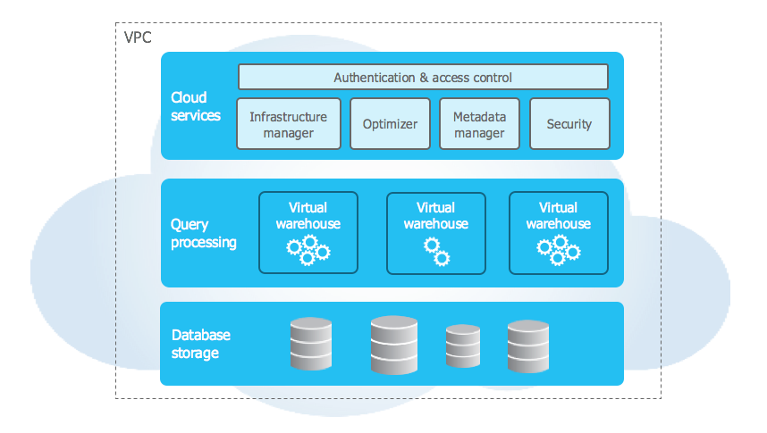

<!--more-->

## Introduction
I have gotten a certification called [Snowpro Core](https://www.snowflake.com/certifications/) and through my study about it I have learnt tips of Snowflake DB.
As the first post about Snowflake, its architecture is shown here.

Snowflake's architecture is completely different from other DBs and I always feel queries run faster than using ones on other DBs. Understanding a role of each architecture leads to
achieve a faster query processing.

Snowflake consists of the following three architectures (see [here](https://docs.snowflake.com/en/user-guide/intro-key-concepts)):

- Cloud Service
- Query Processing
- Database Storage 



The above picture is taken from [here](https://docs.snowflake.com/en/user-guide/intro-key-concepts). Although those three names may be called in other ways, their main roles are the same.
Let's start with the `Cloud Service` architecture.

## Cloud Service Architecture
Cloud Service architecture offers us a login service. Therefore when you login into Snowflake via Snowsight (UI), you use a service provided by the Cloud Service architecture.
Besides, from thr view of query processing, this architecture provides us the following services.

- Query compile / optimization
- Result cache
- Meta-ata management

Queries are compiled in the cloud service architecture (not on computer resources!). As shown later queries themselves are processed in thr Query Processing service but compiling them
is done in the cloud service architecture. It means costs for compiling queries are ignorable (actually costs exist but they are small enough compared to ones for computing).

Result cache service means that a result of a query is returned without computing if that has once been computed. That cache is valid as long as tables involving that query have not been changed after the previous execution. However, if cache has not been used for 24 hours, that cache is not available.

Metadata is also available on the cloud service architecture. For each table, its metadata like the number of rows is stored in the service. Using this metadata, a query like the following can be processed without computing.

```sql
SELECT
  COUNT(1)
FROM table;
```

However, the following requires computing since metadata does not have the number of unique items.

```sql
-- It is assumed the table has `id`
SELECT
  COUNT(DISTINCT id)
FROM table;
```

Metadata is managed for each micro-partition (referred later). To utilize those metadata you can get results faster.


## Conclusion

Cloud Service offers not only a login service but also ones involving queries themselves. Especially, metadata and result cache are keys to fetch
results faster. Some services contained in other architectures have been shown partially (like micro-partition) and they are involved with this architecture.
Next the Query Processing architecture is shown!