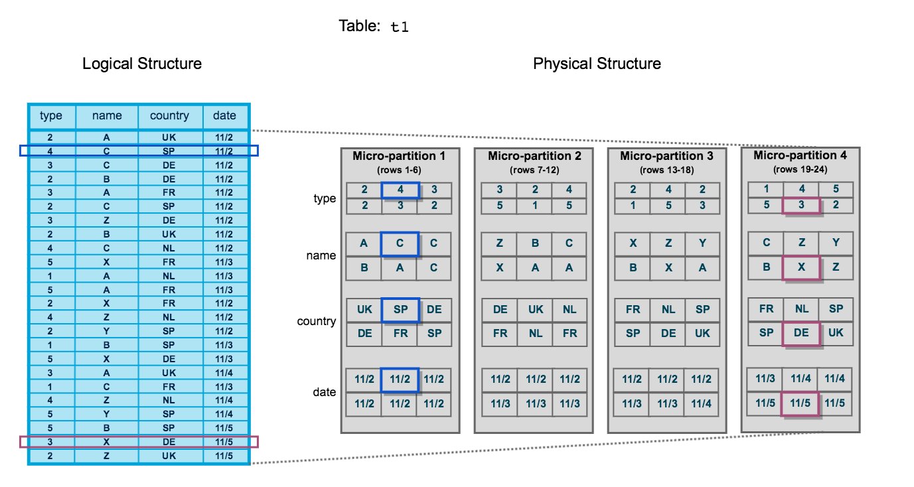

<!--more-->

## Introduction

I have shown two architectures: [Cloud Service]() and [Query Processing](). The last remaining architecture is `Database Storage`.

This `Database Storage` contains data of tables. Note that their metadata are put on `Cloud Service` architecture. In the storage, all the data are managed in units called `Micro Partition`.

## Micro Partition

Once data is loaded into a table, that data is separated into `Micro Partitions`. [An official document](https://docs.snowflake.com/ja/user-guide/tables-clustering-micropartitions) shows its behavior.



As seen in the figure, data in a table consists of four parts. This process is automatically done inside Snowflake. The noticeable points are:

- Data is separated in a straightforward way: following the original order of rows.
- Each micro-partition has its own metadata.
- Micro-partition is immutable: once it is created, it is never changed. 

The first one is that rows are NOT sorted to be separated into micro-partitions. As the figure shows, the micro-partition 1 has the first six rows. the micro-partition 2 has elements with the row-number being between 7 and 12.

The second one is that metadata are managed in units of micro-partitions. For example, on the micro-partition 1 (see the figure), the type column has the range from 2 to 4. Therefore in its metadata, the minimum and maximum values are set 2 and 4, respectively. This metadata is used for pruning. Let us think of the following query.

```sql
SELECT
  *
FROM table
WHERE
  type >= 5
```

As the where clause defines, only elements with type being larger than 4 are required, that is, no elements in the micro-partition 1 are needed. Then using the metadata, the micro-partition 1 is not loaded.

The last one is that micro-partitions are never changed. Even if a table is updated, then new micro-partitions are created (not replaced!). Therefore, snowflake does not provide dirty read because data is not changed in a sense of micro-partitions.

As explained in the last, micro-partitions are not changed. Once a micro-partition is not referred, then it is dropped. That system is shown in the next section.

## Time Travel / Fail Safe

The two functions shown in the section's title are used to recover contents in a table. Although those two seem to be the same, their functions are completely different.


The [following figure](https://docs.snowflake.com/ja/user-guide/data-time-travel) shows abstracts of those two (only `time travel` is marked though).


Time-travel offers us to recover a table as it used to be. You can revert changes like `UPDATE`, `DROP` and so on. The duration of its availability can be set as you want. The maximum date is 90 days if you use `Snowflake Enterprise Edition`. This operation can be executed by yourself.

After the term for the time-travel finishes, you cannot access to the previous data. But if you want to take data back to the previous, you can use `failsafe` function. Note that the operation is NOT done by yourself. All the operations are done by `Snowflake`.

From the above discussions, you may think of setting parameters involving available term as large as possible (e.g. setting the time-travel term 90 days). But then, it means micro-partitions lying on data stay 90 days after the table is dropped. Then additional costs incurred for data staying for 90 days have to be considered. From the view of costs, it is necessary to set those parameters.


## Conclusion

Although data-storage is not a part of a warehouse, it is highly involved with costs and performance (using pruning!). Especially, if data is large, you may have to think of how data is sorted (how micro-partitions are created). For example, if data has a timestamp showing update-time and the column is often used for pruning in a `where` clause, it would be efficient to order the data by the timestamp. That is because sorting data in such a way leads to generate micro-partitions without any overlap in the timestamp. Then, once the timestamp is designated in the `where` clause, only relevant micro-partitions are loaded.
